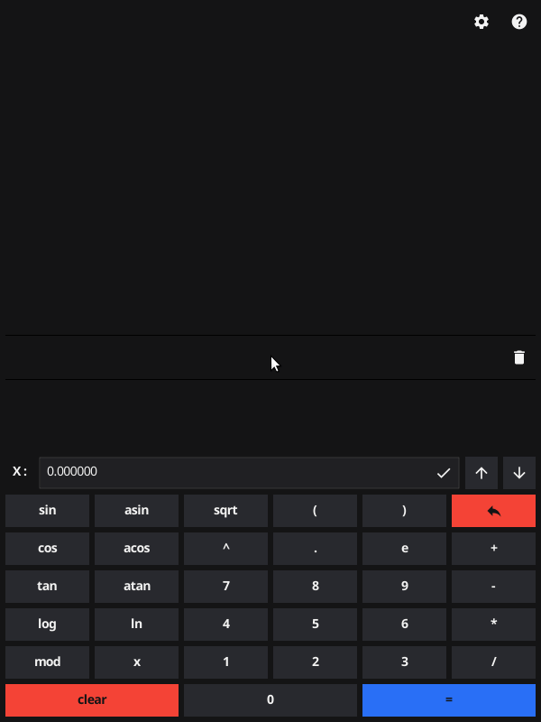

# Smart Calc Go

<!-- markdownlint-disable -->
<div align="center">
  <p align="center">
    <a href="#about">About</a> •
    <a href="#features">Features</a> •
    <a href="#usage">Usage</a>
  </p>
  
</div>
<!-- markdownlint-enable -->

## About

Smart Calc is a feature-rich calculator that supports exponential notation, trigonometric functions, and graph plotting. The core of this calculator is implemented as an algorithm for expression parsing (Dijkstra's algorithm) and calculation of Polish notation. Various computational functions are implemented in C/C++ and integrated into the main codebase, while the program itself is written in Golang(fyne).

## Features

- Implementation of Dijkstra's algorithm for converting expressions to Reverse Polish Notation (Shunting Yard Algorithm).
- The algorithm is written in C++ and integrated using the SWIG utility.
- Follows the Model-View-ViewModel (MVVM) design pattern.
- Cross-compilation support for both Windows and Linux platforms.
- Custom Fyne widgets for UI.
- Features include saving application settings, maintaining a history of calculations, and logging operations with log rotation options.

## Usage

To use this project, you can utilize the following [task](https://taskfile.dev/installation/) commands:

 Build the application:

```shell
task build
```

Create a distribution package ([fyne](https://developer.fyne.io/started/) is required):

```shell
task pack
```

Build for the Linux/Windows platform using fyne-cross ([fyne-cross](https://github.com/fyne-io/fyne-cross/) and [docker](https://docs.docker.com/engine/install/) are required):

```shell
task cross-linux
```

```shell
task cross-windows
```

Run tests:

```shell
task test
```
